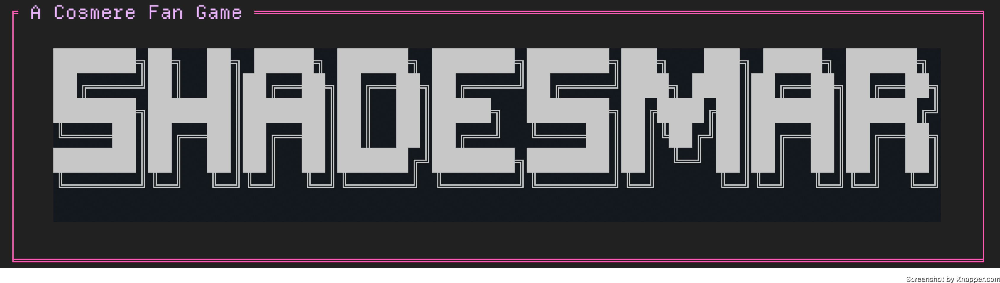
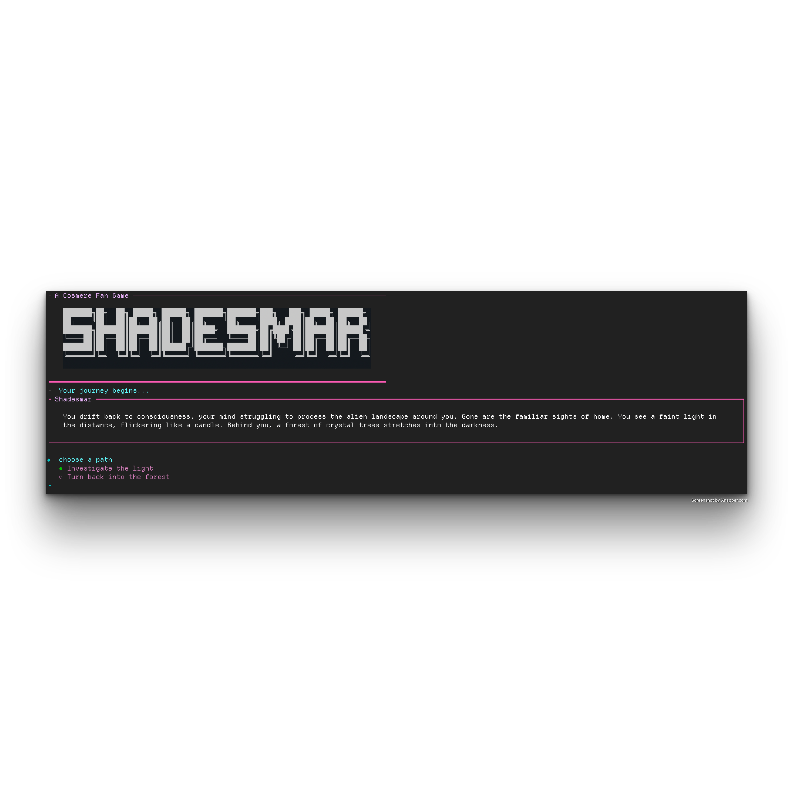

# Shadesmar CLI (beta)

[](https://www.npmjs.com/package/shadesmar-cli)
[](https://nodejs.org)
[](https://ko-fi.com/fernd3v)



An old-school, choose-your-own-adventure terminal game inspired by Brandon Sanderson's Cosmere.

This is a fan-made, non-commercial project. Not affiliated with or endorsed by Brandon Sanderson or Dragonsteel Entertainment.



## Why you'll like it

- Immersive terminal presentation (figlet + boxen + chalk)
- Branching dialogue trees with keyboard-driven choices
- Zero config: install globally and play in seconds

## Requirements

- Node.js 18+ (ES Modules + top‑level await)

## Quick start

```
# global install (recommended)
npm install -g shadesmar-cli@beta

# or run once without installing
npx shadesmar-cli@beta
```

Then launch:

```
shadesmar
# or
shadesmar-cli
```

Use arrow keys to navigate; press Enter to choose.

## Local development

```
npm install
npm run validate-scenes
node index.js
```

### Project layout

- `index.js` – CLI entrypoint and game loop
- `prologue.js` – Prologue scene tree
- `scripts/validateScenes.js` – simple integrity check for scene links

## Troubleshooting

- Ensure Node 18+ (`node -v`). Top‑level await requires modern Node.
- If colors/box borders look odd, try a different terminal font or disable non-UTF8 rendering.
- If your terminal doesn't capture arrow keys properly, try a different terminal app.

## Roadmap

- Additional chapters beyond the prologue
- Save/restore progress
- Accessibility pass (color contrast, screen-reader hints)

## Contributing

PRs welcome for copy, new scenes, or accessibility improvements. Keep scenes small and readable, and run `npm run validate-scenes` before submitting.

• Guidelines: see CONTRIBUTING.md
• Issues: https://github.com/fern-d3v/shadesmar-cli/issues
• Funding: https://ko-fi.com/fernd3v

## License

ISC. See `LICENSE`.

## Credits

- Built with @clack/prompts, chalk, boxen, figlet, and ora.
- World inspired by the Cosmere (Brandon Sanderson). All rights to original IP remain with their respective owners. This tool is for fans, by fans.

---

See the Changelog for release notes: ./CHANGELOG.md
